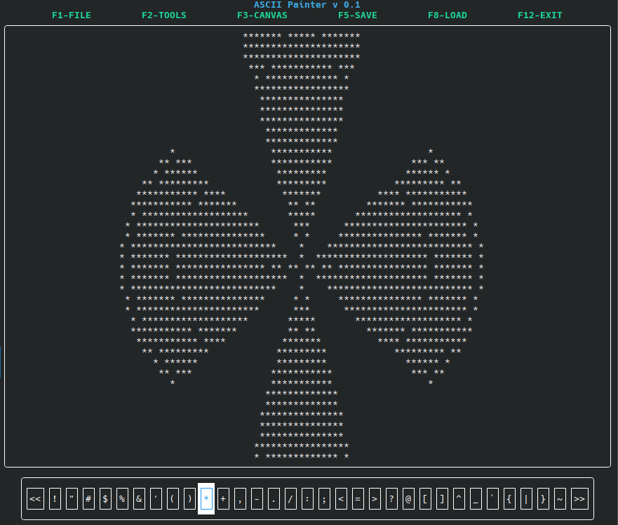

# ASCII Paint

A terminal-based ASCII art creation tool built with FTXUI library.
This is still in progress. This is a toy you can deploy anywhere with
access to modern terminal emulator. You can draw on terminal screen
using ASCII characters.



## Version
Current version: v0.2.0

## Dependencies
- CMake (>= 3.11)
- C++ compiler with C++17 support
- FTXUI library

## Quick Start
### Manual build
```bash
# Clone the repository
git clone https://github.com/spockiash/ASCIIPaint
cd ASCIIpaint

# Create build directory
mkdir build
cd build

# Configure and build
cmake ..
make

# Run the application
./ASCIIpaint
```

## Usage
- *Notice: in current version some functionalities might be incomplete*
- Use function keys to switch between screens
- 'F1' not implemented yet
- 'F2' select tools screen
- 'F3' canvas screen
- other functions coming soon

## Features
- Interactive terminal-based interface
- Real-time ASCII art creation
- Save/Load functionality [not yet]
- Multiple brush characters
- Undo/Redo support [limited]

## Roadmap / To-Do
- [ ] File and save system
- [ ] Multiple color support
- [ ] Different brush sizes
- [ ] Canvas resize functionality
- [ ] Fill tool
- [ ] Project autosave

## License
This project is licensed under the MIT License - see the LICENSE file for details.

## Contributing
Contributions are welcome! Please feel free to submit a Pull Request.

1. Fork the project
2. Create your feature branch (`git checkout -b feature/AmazingFeature`)
3. Commit your changes (`git commit -m 'Add some AmazingFeature'`)
4. Push to the branch (`git push origin feature/AmazingFeature`)
5. Open a Pull Request
